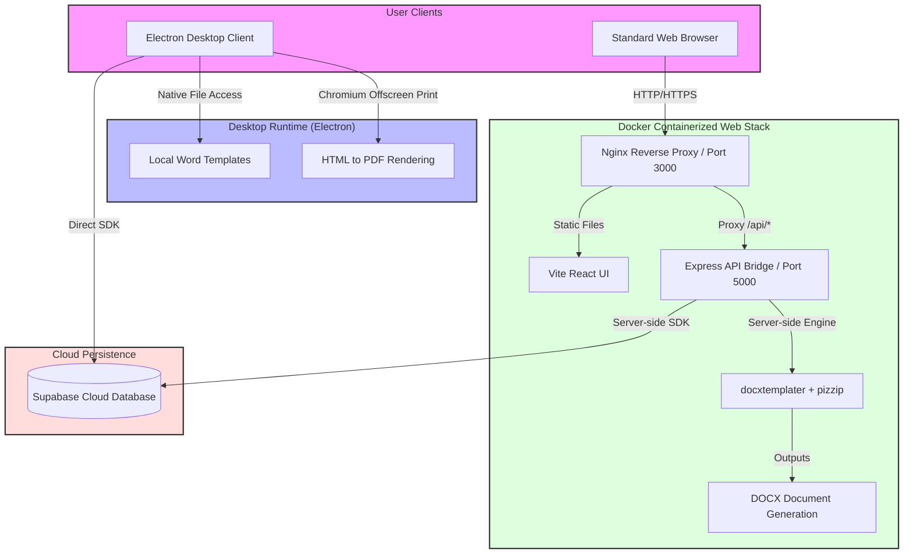

# Meridian Voucher Studio

<p align="center">
  <strong>Cross-platform desktop application and standalone web service for reservation voucher management, dynamic rate lookups, and automated document generation.</strong>
</p>

<p align="center">
  
  
  
  
  
</p>

---

## 📋 Overview

**Meridian Voucher Studio** is an enterprise-grade utility tailored for Destination Management Companies (DMCs). It streamlines the voucher lifecycle—from secure database persistence to exporting professional travel documentation.

The software operates in two primary modes:

1. **Desktop Client (Electron)**: A native application providing local, high-performance HTML-to-PDF rendering alongside local DOCX template assembly.
2. **Web Service (Docker)**: A lightweight, containerized multi-service deployment with an Nginx reverse proxy and an Express API bridge, enabling teams to access voucher management in standard browser environments.

---

## 📐 Architecture Overview

The system handles document templating and data storage seamlessly across both desktop and web platforms.



---

## ✨ Key Features

- **Dynamic Form Assembly**: Streamlined entry workflows for reservation details, rate information, and room configurations.
- **Automated Templating Engine**: Generates Word (`.docx`) and Adobe PDF (`.pdf`) vouchers using a controlled Word template schema via `docxtemplater` and `pizzip`.
- **Supabase Synchronization**: Real-time rate lookup, booking logging, and cloud data synchronization.
- **Dockerized Deployments**: Seamless local orchestration via Docker Compose.
- **Hybrid Bridge Architecture**: A web-bridge polyfill that intercepts IPC calls in browser environments and transparently forwards them to the Express API.

---

## 📁 Repository Layout

```text
├── electron/            # Electron main process, preloads, and system runtime logic
├── src/                 # React UI components, styling, hooks, and browser API bridge
├── templates/           # Word (.docx) templates, schemas, and usage documentation
├── supabase/            # Database schema, seed data, and initial migration scripts
├── scripts/             # Internal maintenance, compilation, and configuration helpers
├── build-resources/     # Build configurations, app icons, and runtime config outputs
├── data/                # Local data storage and machine-specific state (git-ignored)
├── Dockerfile.api       # Container description for the Express API bridge
├── Dockerfile.web       # Container description for the Nginx React client
├── docker-compose.yml   # Multi-container local deployment configuration
└── package.json         # Electron Builder definitions, project dependencies, and scripts
```

---

## 🚀 Getting Started

### Prerequisites

Ensure you have the following installed on your development machine:

- **Node.js** (v18 or higher recommended)
- **npm** (v9 or higher)
- **Docker & Docker Compose** (required for containerized web mode)

---

### Setup & Installation

1. **Clone the Repository and Install Dependencies**

   ```bash
   npm ci
   ```
2. **Configure Environment Variables**
   Copy the template environment file:

   ```bash
   copy .env.example .env
   ```

   Open the newly created `.env` file and populate it with your Supabase credentials and API configurations:

   ```ini
   SUPABASE_URL=https://your-project.supabase.co
   SUPABASE_ANON_KEY=your-anon-public-key
   VOUCHER_API_PORT=5183
   ```
3. **Synchronize Public Configuration**
   Generate the public runtime config used by Electron builds:

   ```bash
   npm run sync:public-config
   ```

   > [!NOTE]
   > This generates `build-resources/config.json` from `.env`. This file is git-ignored to prevent exposing sensitive environment settings.
   >

---

### Development Workflows

#### Run Desktop Client (Electron)

To launch the React hot-reloading server alongside Electron:

```bash
npm run dev
```

#### Run Web Service (Docker Compose)

To launch the full web stack (React served via Nginx on port `3000`, API on port `5000`):

```bash
docker compose up --build -d
```

For deep dive instructions on the containerized environment, consult the [DOCKER.md](file:///d:/repos/meridian_voucher_studio/DOCKER.md) document.

---

## 🛠️ CLI Script Index

| Command                        | Description                                                                                 |
| :----------------------------- | :------------------------------------------------------------------------------------------ |
| `npm run dev`                | Starts the concurrent React Vite development server and Electron shell.                     |
| `npm run build`              | Syncs config, cleans old builds, typechecks TypeScript, and compiles Vite/Electron sources. |
| `npm run dist`               | Packages the application into local distribution installers without signing.                |
| `npm run dist:signed`        | Builds and signs the final production desktop installers.                                   |
| `npm run sync:public-config` | Transforms current`.env` properties into `build-resources/config.json`.                 |
| `npm run start:api`          | Starts the standalone server bridge API locally (`dist-electron/main/standalone.js`).     |
| `npm run typecheck`          | Validates both React UI and Electron main process TypeScript source code.                   |
| `npm run lint`               | Runs static analysis checks using ESLint rules.                                             |
| `npm run format`             | Enforces unified styling via Prettier across all supported extensions.                      |
| `npm run clean`              | Deletes build output folders (`dist/` and `dist-electron/`).                            |

---

## 📄 Voucher Template Management

Customizing generated voucher templates is managed through structured Word files. Key guidelines:

- Place the active template at `templates/voucher-template.docx`.
- The document generator supports conditional fields (e.g., `{#isReservation}`, `{#isAmendment}`) and looping blocks (e.g., `{#lineItems}`).
- Comprehensive schema structures and formatting rules are detailed in [templates/README.md](file:///d:/repos/meridian_voucher_studio/templates/README.md).

---

## 🗄️ Database Integration

Database schemas, triggers, and seed files are stored inside the `supabase/` directory:

- [schema.sql](file:///d:/repos/meridian_voucher_studio/supabase/schema.sql): Database table definitions, relations, and indexing.
- [seed.sql](file:///d:/repos/meridian_voucher_studio/supabase/seed.sql): Initial lookup tables and reference datasets.

These scripts can be executed via the Supabase Dashboard SQL Editor or integrated directly into your preferred migration toolset.

---

## 🔒 Security & Release Checklist

Prior to pushing modifications to git remotes or cutting a production build:

1. Verify no `.env` or configurations containing API keys are tracked by version control.
2. Review the release pipeline instructions in [PUSH_CHECKLIST.md](file:///d:/repos/meridian_voucher_studio/PUSH_CHECKLIST.md).

---

<p align="center">
  Developed by <strong>Meridian Destination Management</strong>. Released under the <a href="file:///d:/repos/meridian_voucher_studio/LICENSE">MIT License</a>.
</p>
